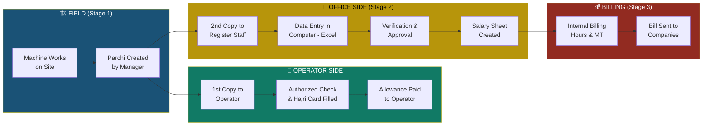
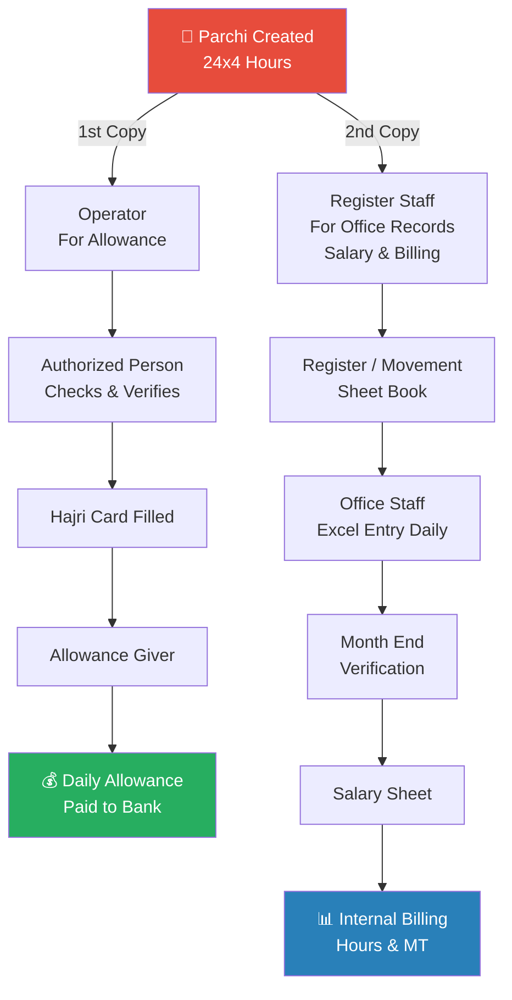
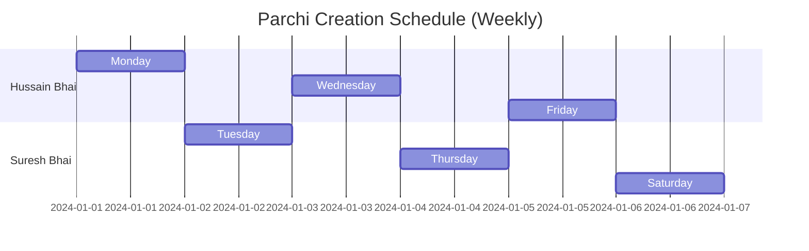

# Overall Process Flow — Parchi to Billing

## Complete End-to-End Flow



## Parchi Copy Distribution



## Manager Schedule



## Summary Flow (Text)

```
1st Copy Flow:
  Parchi → Operator → Authorized Person Checks
  → Hajri Card Filled → Allowance Giver → Daily Allowance Paid ✅

2nd Copy Flow:
  Parchi → Sunil & Omprakash (Register Book) → Office Staff (Excel Entry Daily)
  → Month End (Hajri Verification) → Salary Sheet → Internal Billing (RKT & Shu Shipping) ✅
```
