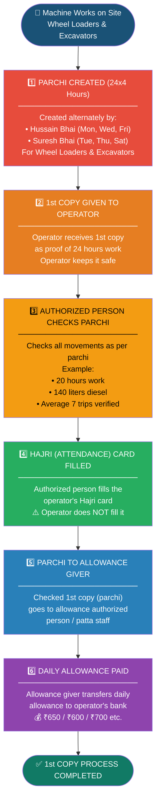
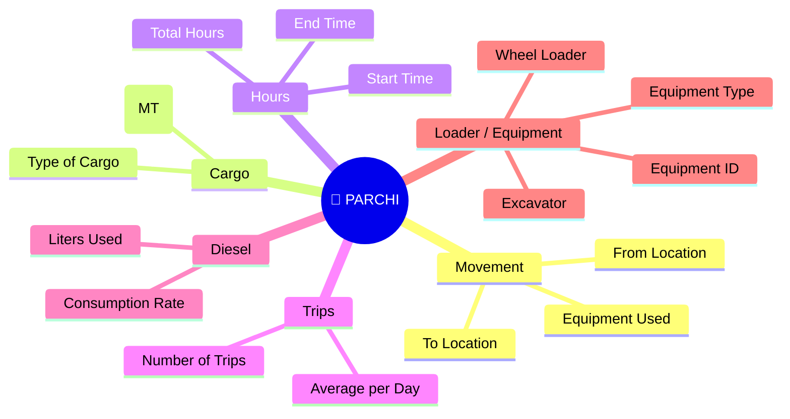
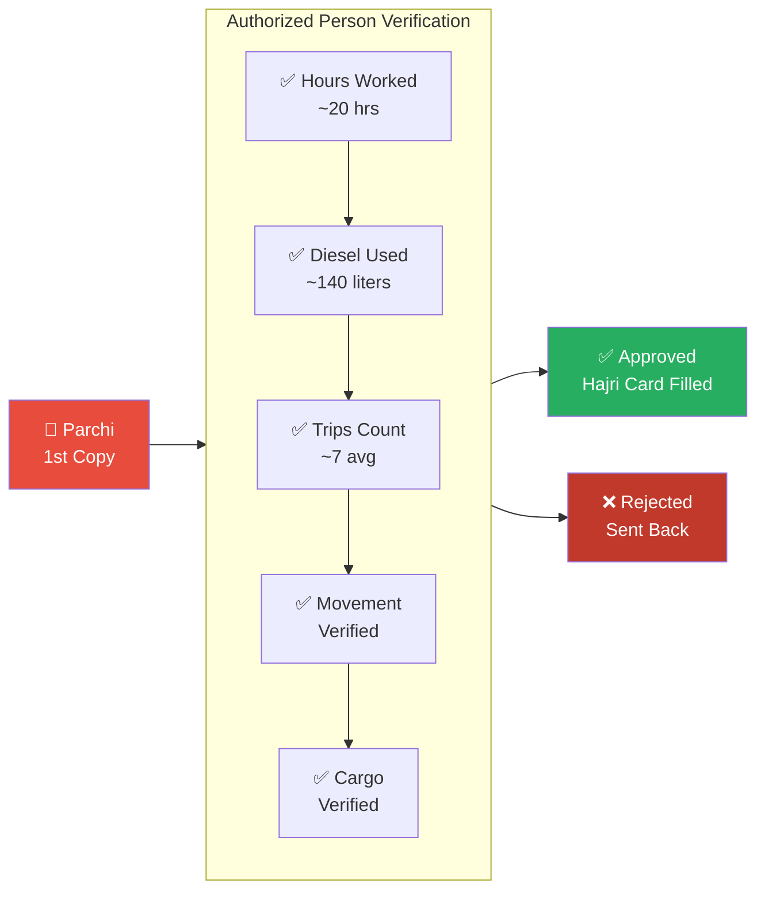

# Stage 1: Parchi Flow — Operator Side (Allowances)

## 1st Copy Process Flow

## Parchi Data Captured

## Verification Checklist

## Allowance Rates

| Allowance Type | Amount (₹) |
|---------------|-----------|
| Standard | 650 |
| Reduced | 600 |
| Premium | 700 |

> Note: Allowance amount may vary based on equipment type, shift, or operator category.
