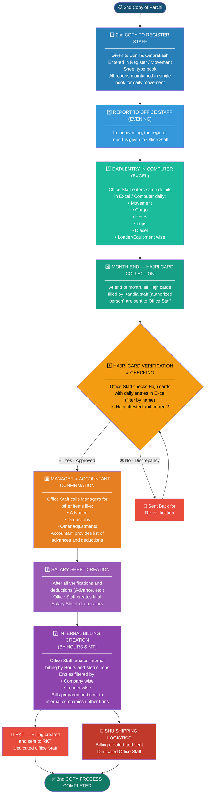
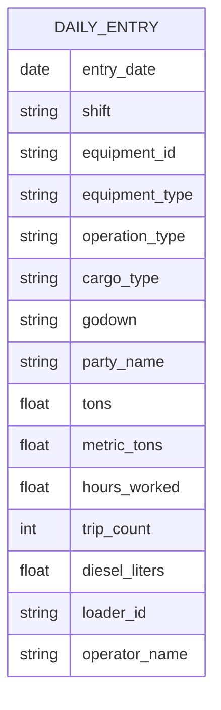
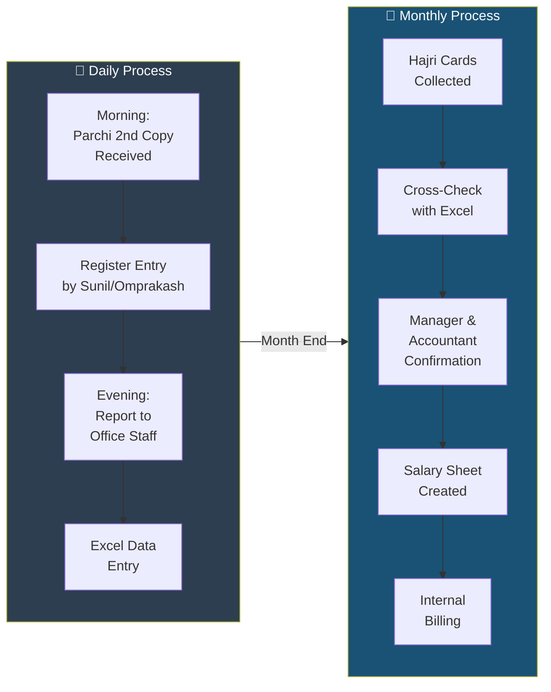
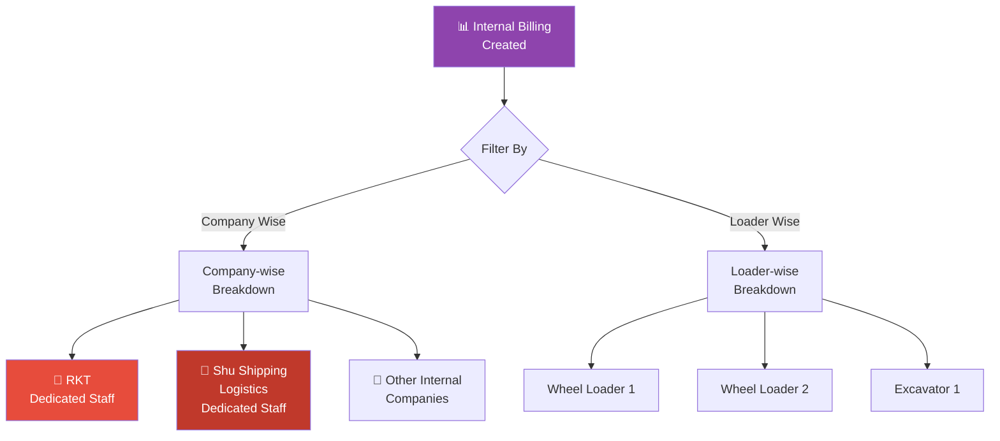

# Stage 2: Office Record Flow — Office Side

## 2nd Copy Process Flow



## Daily Data Entry Fields



## Office Workflow Timeline



## Billing Recipients



## Summary — 2nd Copy Flow

```
2nd Copy → Sunil & Omprakash (Register Book) 
  → Office Staff (Excel Entry Daily) 
  → Month End (Hajri Verification) 
  → Salary Sheet 
  → Internal Billing (RKT & Shu Shipping Logistics)
```
