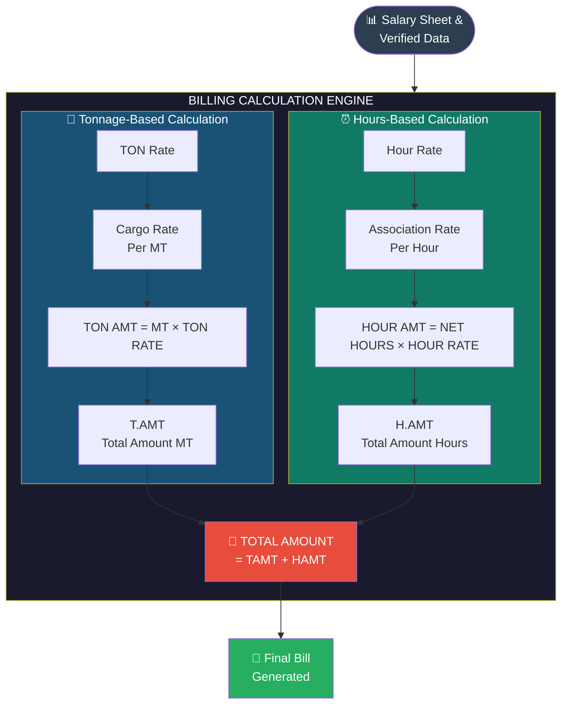
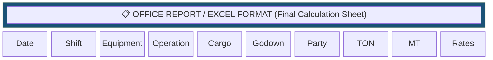
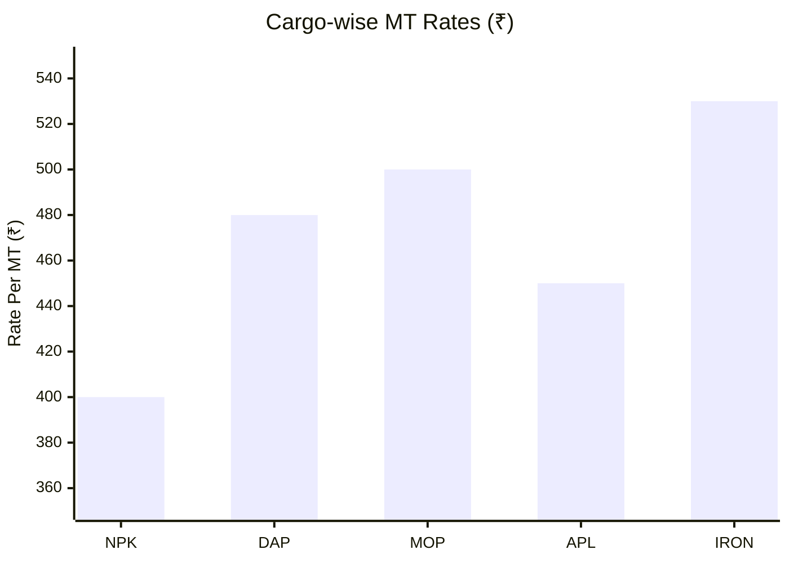
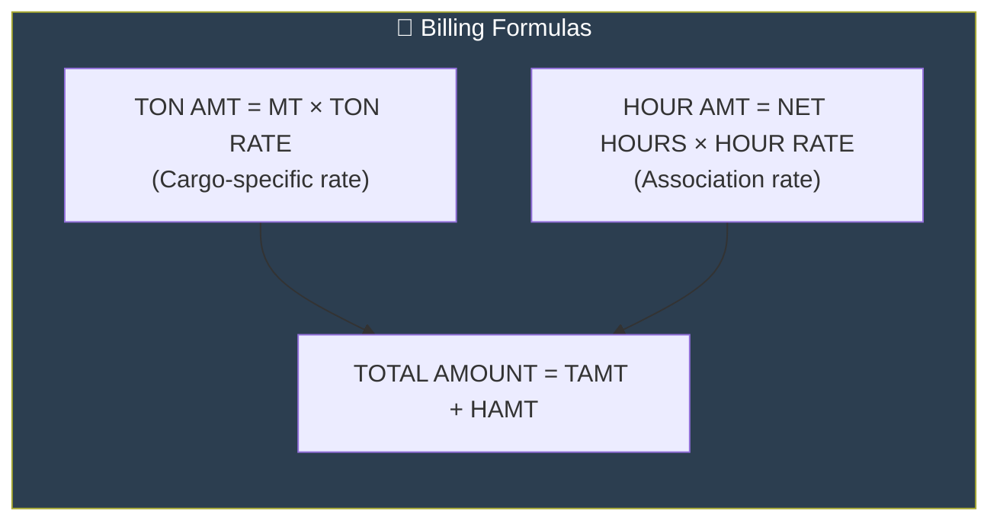
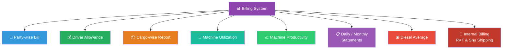

# Stage 3: Billing — Excel Report & Final Bill

## Billing Calculation Flow



## Excel Report Structure



### Billing Column Details

| Column | Description | Example |
|--------|-------------|---------|
| Date | Entry date | 2024-01-15 |
| Shift | Day/Night shift | Day |
| Equipment | Loader/Excavator ID | WL-01 |
| Operation | Type of operation | Loading |
| Cargo | Type of cargo | NPK, DAP, MOP |
| Godown | Warehouse/storage | Godown-A |
| Party | Client/company name | RKT |
| TON | Tonnage amount | 50 |
| MT | Metric Tons | 50 |
| TON RATE | Rate per MT (cargo-wise) | ₹400 |
| HOUR RATE | Rate per hour | ₹1500 |
| T.AMT | TON Amount | ₹20,000 |
| H.AMT | HOUR Amount | ₹30,000 |
| TOTAL | T.AMT + H.AMT | ₹50,000 |

## Cargo-wise MT Rates



| Cargo | Rate (Per MT) ₹ |
|-------|-----------------|
| NPK | 400 |
| DAP | 480 |
| MOP | 500 |
| APL | 450 |
| IRON | 530 |

## Hour Rate (Association)

| Parameter | Value |
|-----------|-------|
| Rate (Per Hour) | ₹1,500 |
| Note | Rate changes as per Association daily |

## Amount Calculation Formulas



### Example Calculation

```
Operator: Ram Kumar
Date: 2024-01-15
Equipment: Wheel Loader WL-01
Cargo: NPK

Tonnage Calculation:
  MT loaded    = 50 MT
  TON RATE     = ₹400/MT (NPK rate)
  TON AMT      = 50 × 400 = ₹20,000

Hours Calculation:
  Net Hours    = 20 hours
  HOUR RATE    = ₹1,500/hour
  HOUR AMT     = 20 × 1500 = ₹30,000

TOTAL AMOUNT   = ₹20,000 + ₹30,000 = ₹50,000
```

## Final Outputs Generated


