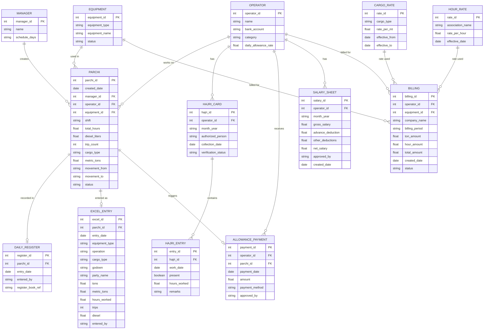
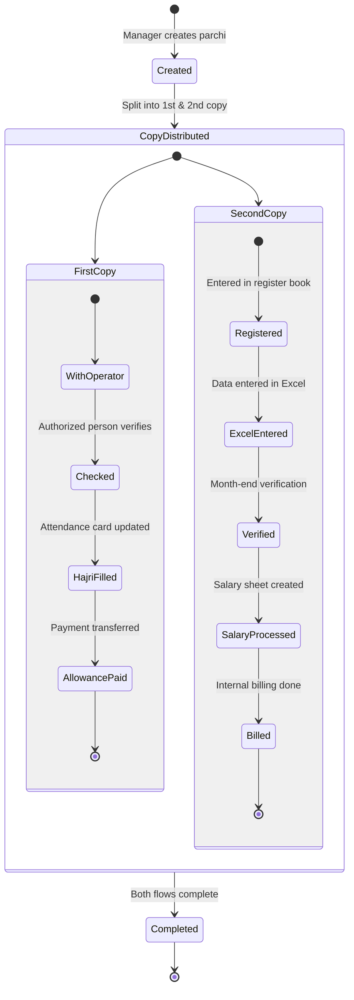
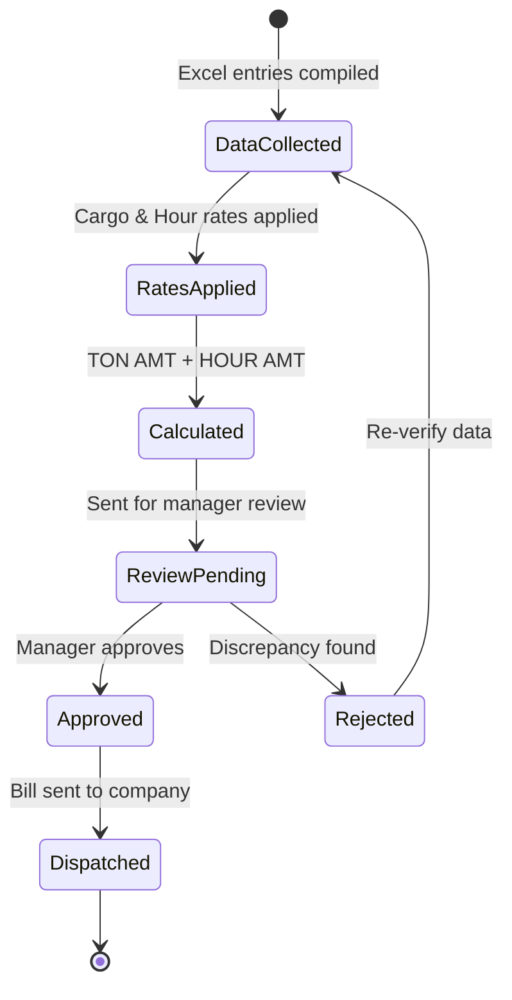

# Data Model — Transportation Reporting System

## Entity Relationship Diagram

## Key Entities

### Core Entities
| Entity | Description |
|--------|-------------|
| **Operator** | The machine operator working on site |
| **Equipment** | Wheel loaders, excavators, etc. |
| **Manager** | Field managers who create parchi (Hussain Bhai / Suresh Bhai) |
| **Parchi** | The primary document — a 24-hour work slip |

### Process Entities
| Entity | Description |
|--------|-------------|
| **Hajri Card** | Monthly attendance card for each operator |
| **Hajri Entry** | Daily attendance record within a Hajri card |
| **Daily Register** | Physical register book entry (2nd copy) |
| **Excel Entry** | Digital data entry of parchi in Excel |

### Financial Entities
| Entity | Description |
|--------|-------------|
| **Allowance Payment** | Daily allowance paid to operator from 1st copy |
| **Salary Sheet** | Monthly salary after verification and deductions |
| **Cargo Rate** | Rate per MT for different cargo types |
| **Hour Rate** | Hourly rate from association (changes daily) |
| **Billing** | Final internal billing sent to companies |

## State Diagrams

### Parchi Lifecycle

### Billing Status Flow

