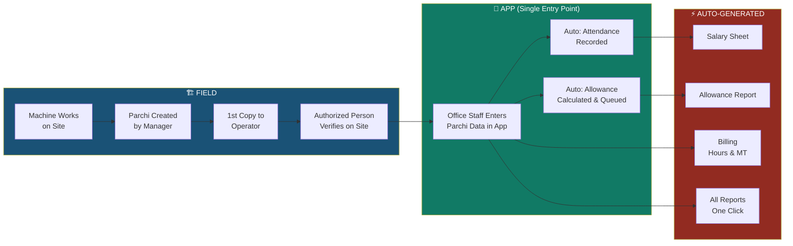
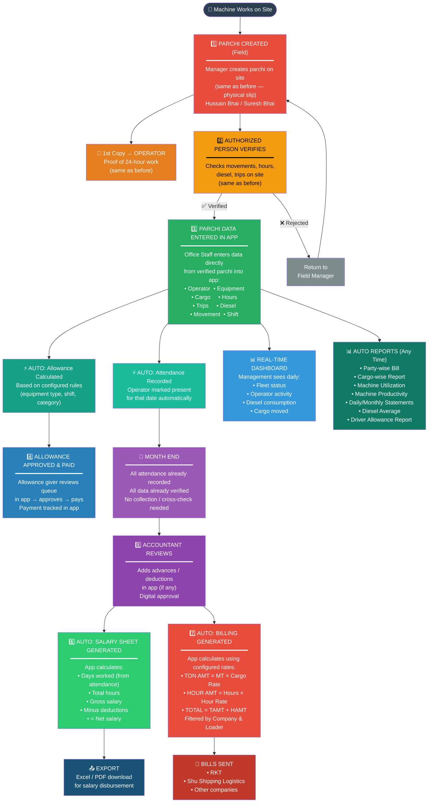
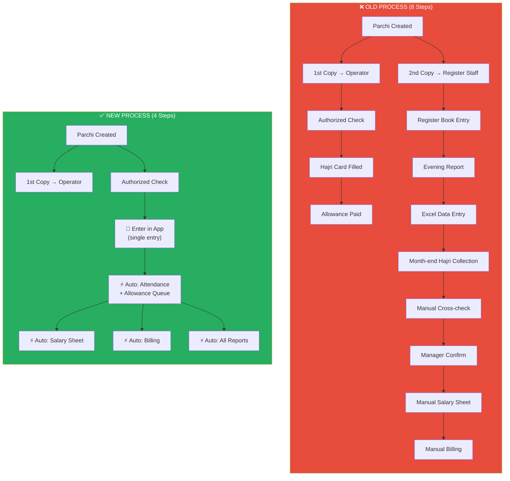
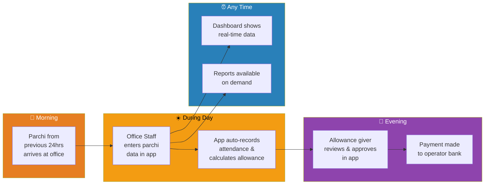
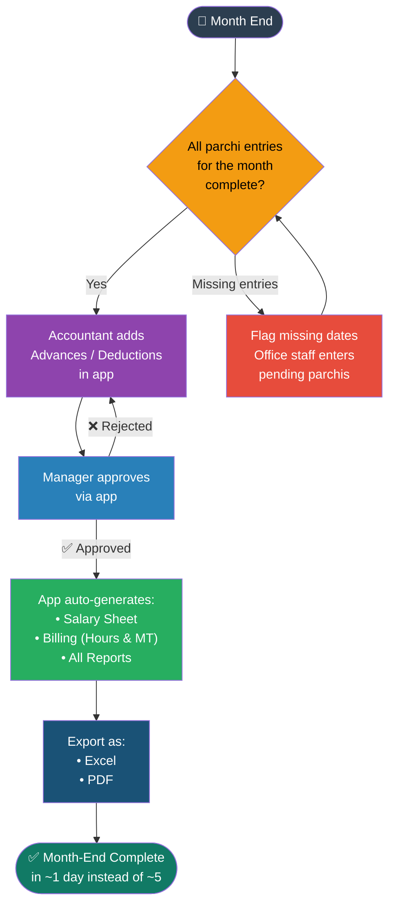
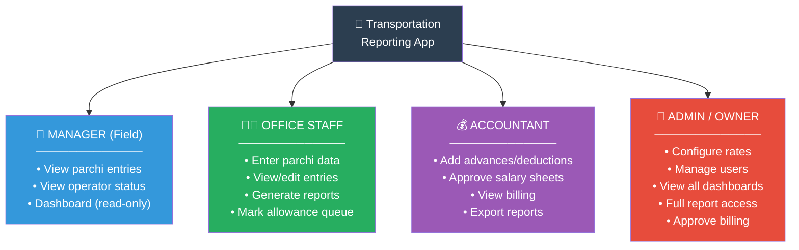

# New Digitalized Process Flow

## Overall New Flow (Simplified)

## Detailed New Process Flow

## Old vs New — Side by Side

## New Daily Workflow Timeline

## Month-End Workflow (New — Simplified)

## Role-Based Access in App

