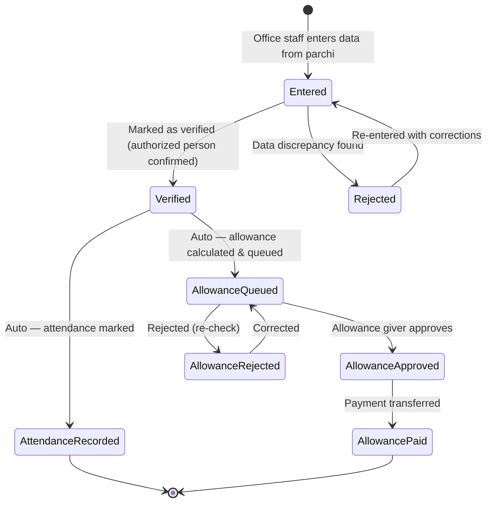
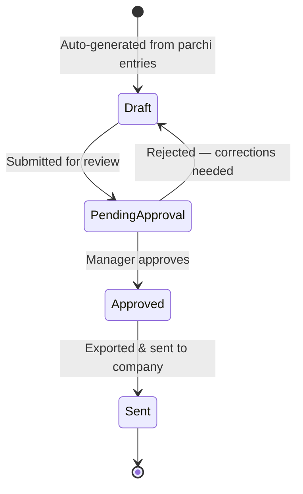
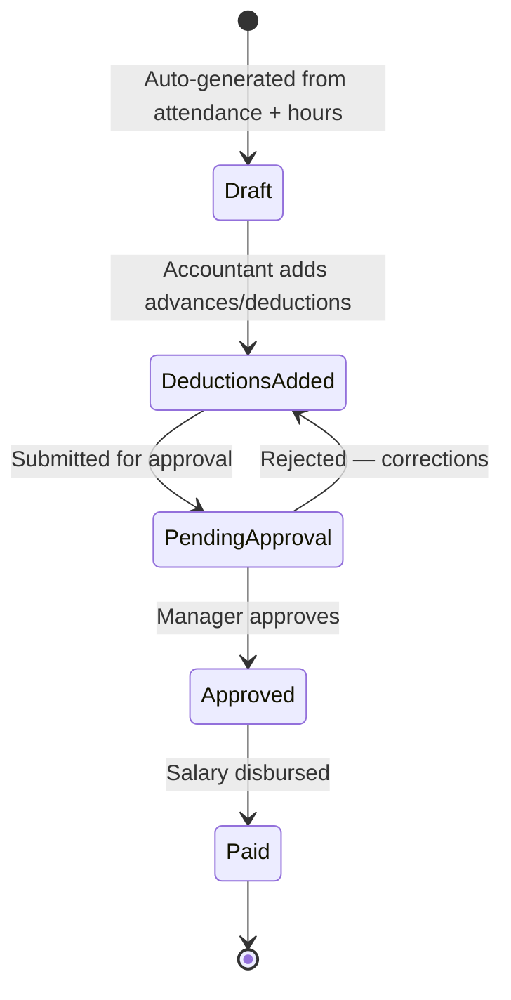

# New Data Model — Digitalized System

## Changes from Old Model

| Change | Old | New |
|--------|-----|-----|
| **DAILY_REGISTER** | Separate entity | ❌ **Removed** — no physical register |
| **EXCEL_ENTRY** | Separate entity | ❌ **Removed** — merged into PARCHI_ENTRY |
| **HAJRI_CARD / HAJRI_ENTRY** | Separate entities | ❌ **Removed** — attendance auto-generated from parchi entries |
| **PARCHI_ENTRY** | Did not exist | ✅ **New** — single entry from parchi, replaces register + Excel + Hajri |
| **ATTENDANCE** | Did not exist (was Hajri) | ✅ **New** — auto-generated from parchi entries |
| **RATE_CONFIG** | Informal / manual | ✅ **New** — configurable cargo & hour rates with effective dates |
| **APPROVAL** | Did not exist | ✅ **New** — digital approval workflow with audit trail |
| **USER** | Did not exist | ✅ **New** — role-based access control |
| **AUDIT_LOG** | Did not exist | ✅ **New** — tracks all changes |

## New Entity Relationship Diagram

```mermaid
erDiagram
    USER {
        int user_id PK
        string name
        string email
        string phone
        string password_hash
        string role "admin | office_staff | accountant | manager | allowance_giver"
        boolean is_active
        datetime created_at
    }

    OPERATOR {
        int operator_id PK
        string name
        string phone
        string bank_account
        string bank_name
        string category "senior | junior | trainee"
        float default_allowance_rate
        boolean is_active
        datetime created_at
    }

    EQUIPMENT {
        int equipment_id PK
        string equipment_code "e.g. WL-01, EX-03"
        string equipment_type "wheel_loader | excavator"
        string equipment_name
        string status "active | maintenance | retired"
        datetime created_at
    }

    PARTY {
        int party_id PK
        string party_name "e.g. RKT, Shu Shipping Logistics"
        string contact_person
        string phone
        string email
        string address
        boolean is_active
    }

    GODOWN {
        int godown_id PK
        string godown_name
        string location
        boolean is_active
    }

    CARGO_TYPE {
        int cargo_type_id PK
        string cargo_name "NPK | DAP | MOP | APL | IRON"
        string description
        boolean is_active
    }

    CARGO_RATE {
        int rate_id PK
        int cargo_type_id FK
        float rate_per_mt
        date effective_from
        date effective_to "null = current"
        int created_by FK
        datetime created_at
    }

    HOUR_RATE {
        int rate_id PK
        string association_name
        float rate_per_hour
        date effective_date
        int created_by FK
        datetime created_at
    }

    ALLOWANCE_RULE {
        int rule_id PK
        string equipment_type "wheel_loader | excavator | all"
        string operator_category "senior | junior | trainee | all"
        string shift_type "day | night | all"
        float allowance_amount
        date effective_from
        date effective_to "null = current"
    }

    PARCHI_ENTRY {
        int entry_id PK
        date parchi_date
        string parchi_number "unique reference"
        int operator_id FK
        int equipment_id FK
        int cargo_type_id FK
        int party_id FK
        int godown_id FK
        string shift "day | night"
        string operation_type "loading | unloading | transport"
        float total_hours
        float net_hours "billable hours"
        float metric_tons
        int trip_count
        float diesel_liters
        string movement_from
        string movement_to
        string field_manager_name
        string verified_by "authorized person name"
        string verification_status "pending | verified | rejected"
        string remarks
        int entered_by FK
        datetime entered_at
        datetime updated_at
    }

    ATTENDANCE {
        int attendance_id PK
        int operator_id FK
        date work_date
        boolean present "auto-set true when parchi entry exists"
        float total_hours "sum of parchi hours for that day"
        int parchi_entry_id FK "source parchi"
        string source "auto | manual_override"
        datetime created_at
    }

    ALLOWANCE_PAYMENT {
        int payment_id PK
        int operator_id FK
        int parchi_entry_id FK
        date payment_date
        float calculated_amount "auto from allowance rules"
        float actual_amount "may differ if override"
        string status "queued | approved | paid | rejected"
        int approved_by FK
        string payment_reference
        datetime created_at
        datetime updated_at
    }

    SALARY_SHEET {
        int salary_id PK
        int operator_id FK
        string month_year "e.g. 2024-01"
        int days_present "from attendance"
        float total_hours "from parchi entries"
        float gross_amount
        float advance_deduction
        float other_deductions
        string deduction_remarks
        float net_salary
        string status "draft | pending_approval | approved | paid"
        int generated_by FK
        int approved_by FK
        datetime created_at
        datetime approved_at
    }

    BILLING {
        int billing_id PK
        int party_id FK
        string billing_period "e.g. 2024-01"
        string billing_type "internal | external"
        float total_ton_amount
        float total_hour_amount
        float grand_total
        string status "draft | pending_approval | approved | sent"
        int generated_by FK
        int approved_by FK
        datetime created_at
        datetime approved_at
    }

    BILLING_LINE_ITEM {
        int line_id PK
        int billing_id FK
        int parchi_entry_id FK
        date entry_date
        int equipment_id FK
        int cargo_type_id FK
        float metric_tons
        float cargo_rate_applied
        float ton_amount "MT x cargo_rate"
        float net_hours
        float hour_rate_applied
        float hour_amount "hours x hour_rate"
        float line_total "ton_amount + hour_amount"
    }

    APPROVAL {
        int approval_id PK
        string entity_type "allowance | salary | billing"
        int entity_id "FK to respective table"
        string action "submitted | approved | rejected"
        int action_by FK
        string remarks
        datetime action_at
    }

    AUDIT_LOG {
        int log_id PK
        int user_id FK
        string action "create | update | delete | approve | reject | export"
        string entity_type
        int entity_id
        string old_value "JSON"
        string new_value "JSON"
        datetime timestamp
    }

    USER ||--o{ PARCHI_ENTRY : "enters"
    USER ||--o{ APPROVAL : "performs"
    USER ||--o{ AUDIT_LOG : "generates"

    OPERATOR ||--o{ PARCHI_ENTRY : "works in"
    OPERATOR ||--o{ ATTENDANCE : "has"
    OPERATOR ||--o{ ALLOWANCE_PAYMENT : "receives"
    OPERATOR ||--o{ SALARY_SHEET : "has"

    EQUIPMENT ||--o{ PARCHI_ENTRY : "used in"

    CARGO_TYPE ||--o{ CARGO_RATE : "has rates"
    CARGO_TYPE ||--o{ PARCHI_ENTRY : "carried in"

    PARTY ||--o{ PARCHI_ENTRY : "associated"
    PARTY ||--o{ BILLING : "billed to"

    GODOWN ||--o{ PARCHI_ENTRY : "stored at"

    PARCHI_ENTRY ||--o| ATTENDANCE : "auto-creates"
    PARCHI_ENTRY ||--o| ALLOWANCE_PAYMENT : "triggers"
    PARCHI_ENTRY ||--o{ BILLING_LINE_ITEM : "billed as"

    BILLING ||--o{ BILLING_LINE_ITEM : "contains"

    CARGO_RATE ||--o{ BILLING_LINE_ITEM : "rate used"
    HOUR_RATE ||--o{ BILLING_LINE_ITEM : "rate used"
```

## Entity Summary

### Master Data (configured once, updated rarely)
| Entity | Purpose |
|--------|---------|
| **USER** | App users with role-based access |
| **OPERATOR** | Machine operators (workers) |
| **EQUIPMENT** | Wheel loaders, excavators |
| **PARTY** | Companies billed (RKT, Shu Shipping, etc.) |
| **GODOWN** | Warehouses / storage locations |
| **CARGO_TYPE** | Types of cargo (NPK, DAP, MOP, APL, IRON) |
| **CARGO_RATE** | Rate per MT for each cargo type (with effective dates) |
| **HOUR_RATE** | Hourly rate from association (with effective dates) |
| **ALLOWANCE_RULE** | Rules for auto-calculating daily allowance |

### Transactional Data (created daily)
| Entity | Purpose |
|--------|---------|
| **PARCHI_ENTRY** | Core entity — all data from a single parchi slip |
| **ATTENDANCE** | Auto-generated from parchi entries |
| **ALLOWANCE_PAYMENT** | Auto-calculated, queued for approval & payment |

### Generated Data (monthly)
| Entity | Purpose |
|--------|---------|
| **SALARY_SHEET** | Auto-generated salary for each operator per month |
| **BILLING** | Auto-generated bill header per party per period |
| **BILLING_LINE_ITEM** | Individual line items in a bill (from parchi entries) |

### System Data
| Entity | Purpose |
|--------|---------|
| **APPROVAL** | Tracks all approval actions across entities |
| **AUDIT_LOG** | Full audit trail of all changes |

## State Diagrams

### Parchi Entry Lifecycle (New)

### Billing Lifecycle (New)

### Salary Sheet Lifecycle (New)

