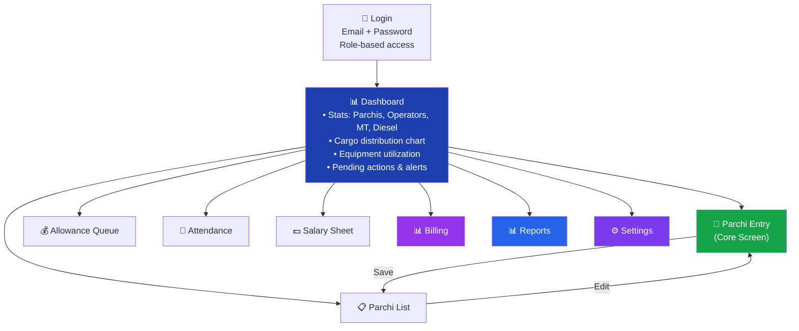
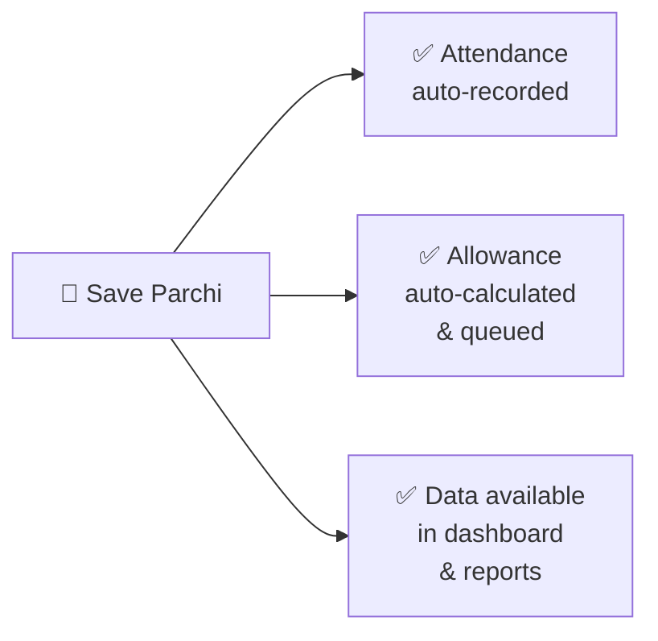
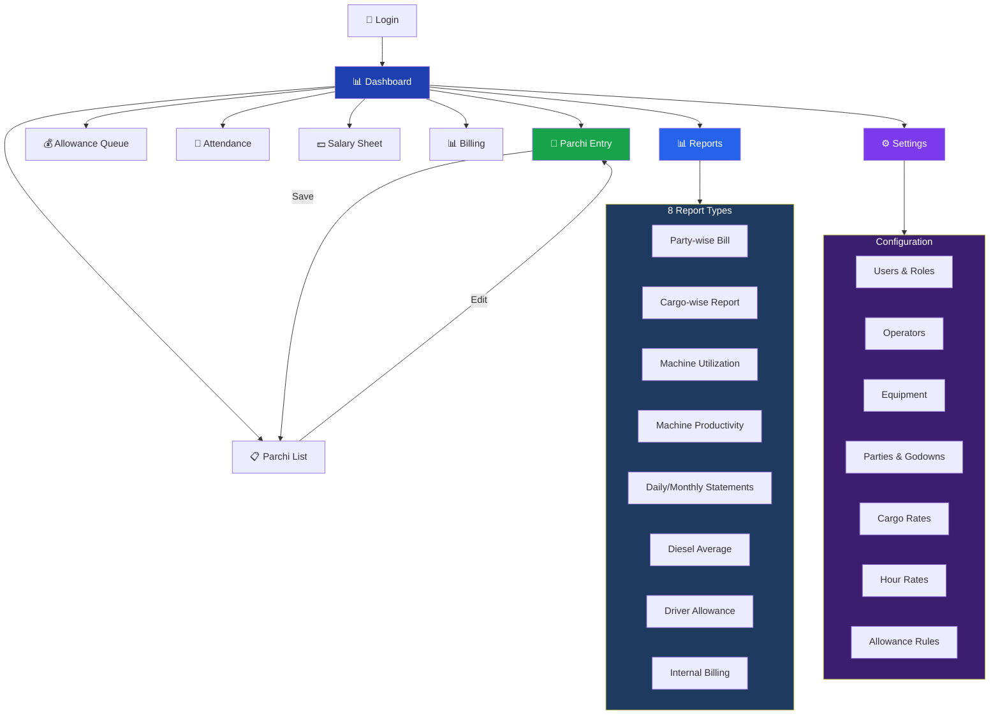

# App Feature Specification — Transportation Reporting

## Tech Stack Recommendation

| Layer | Recommended | Why |
|-------|-------------|-----|
| **Frontend** | React + TailwindCSS + shadcn/ui | Modern, fast, responsive — works on desktop & mobile |
| **Backend** | Node.js (Express) or Python (FastAPI) | Simple REST APIs, fast development |
| **Database** | PostgreSQL | Reliable, handles relational data well, free |
| **Auth** | JWT-based role auth | Simple, secure, role-based access |
| **Export** | ExcelJS + PDFKit | Generate Excel & PDF reports from app |
| **Hosting** | Cloud (AWS/Azure) or self-hosted | Based on budget |

---

## App Screens & Features

### Screen Overview

---

### 1. Login & Authentication

| Feature | Details |
|---------|---------|
| **Login fields** | Email / Phone + Password |
| **Roles** | Admin, Office Staff, Accountant, Manager, Allowance Giver |
| **Behavior** | Each role sees only relevant menu items and data |

---

### 2. Dashboard (Home)

| Widget | Content | Visible To |
|--------|---------|------------|
| **Stat Cards** | Parchis entered today, Active operators, Total MT today, Diesel used today | All roles |
| **Cargo Distribution** | Pie chart — NPK 40%, DAP 25%, MOP 20%, Other 15% | All roles |
| **Equipment Utilization** | Bar chart — hours per equipment (WL-01: 80%, WL-02: 60%, etc.) | All roles |
| **Pending Actions** | Allowances awaiting approval, Salary sheets pending, Missing parchi entries | Role-specific |
| **Quick Links** | Enter Parchi, View Reports, Approve Allowance | Role-specific |

---

### 3. Parchi Entry (Core Screen)

This is the **most important screen** — all data flows from here.

**Form Fields:**

| Row | Field 1 | Field 2 |
|-----|---------|---------|
| 1 | **Parchi Date** (date picker) | **Parchi Number** (auto-generated) |
| 2 | **Operator** (searchable dropdown) | **Equipment** (searchable dropdown) |
| 3 | **Shift** (Day / Night) | **Operation** (Loading / Unloading / Transport) |
| 4 | **Cargo Type** (NPK / DAP / MOP / APL / IRON) | **Party** (RKT / Shu Shipping / etc.) |
| 5 | **Godown** (dropdown) | — |
| 6 | **Total Hours** (number) | **Net Hours** (billable hours) |
| 7 | **Metric Tons** (number) | **Trip Count** (number) |
| 8 | **Diesel Liters** (number) | — |
| 9 | **Movement From** (text) | **Movement To** (text) |
| 10 | **Field Manager** (text) | **Verified By** (text) |
| 11 | **Remarks** (textarea, full width) | — |

**Auto-actions shown before save:**
> ✅ Attendance will be auto-recorded for [Operator] on [Date]
> ✅ Allowance = ₹650 (Wheel Loader / Senior) — queued for approval

**Buttons:** `Save` | `Save & Add Next` | `Clear`

**Validations:**
- Hours ≤ 24
- Diesel within reasonable range (configurable)
- Operator + Date flagged if duplicate entry
- Required: Operator, Equipment, Date, Shift, Hours, Cargo

**What happens on Save:**

---

### 4. Parchi Entry List

| Feature | Details |
|---------|---------|
| **Search** | By operator name, equipment, cargo type |
| **Filters** | Date range, Equipment, Cargo, Party |
| **Columns** | #, Date, Operator, Equipment, Cargo, MT, Hours, Actions (Edit) |
| **Footer** | Total MT, Total Hours for filtered results |
| **Pagination** | 20 per page |
| **Export** | Excel download of filtered data |

**Sample Data:**

| # | Date | Operator | Equip | Cargo | MT | Hours |
|---|------|----------|-------|-------|----|-------|
| 1 | 28/05 | Ram Kumar | WL-01 | NPK | 45 | 20 |
| 2 | 28/05 | Suresh P. | EX-03 | DAP | 30 | 18 |
| 3 | 27/05 | Mohan L. | WL-02 | IRON | 55 | 22 |
| 4 | 27/05 | Ram Kumar | WL-01 | MOP | 40 | 19 |
| | | | **Total** | | **170** | **79** |

---

### 5. Allowance Management

| Feature | Details |
|---------|---------|
| **Tabs** | Pending, Approved, Paid, Rejected |
| **Columns** | Date, Operator, Equipment, Calculated Amount, Status, Actions |
| **Bulk actions** | Select multiple → Approve / Reject all |
| **Auto-calculated** | Amount comes from Allowance Rules (equipment type × shift × category) |

**Sample Queue:**

| Date | Operator | Equipment | Amount | Status |
|------|----------|-----------|--------|--------|
| 28/05 | Ram Kumar | WL-01 | ₹650 | ⏳ Pending |
| 28/05 | Suresh P. | EX-03 | ₹600 | ✅ Approved |
| 27/05 | Mohan L. | WL-02 | ₹700 | 💰 Paid |

---

### 6. Attendance View

**Auto-generated** from parchi entries — no manual input.

| Feature | Details |
|---------|---------|
| **View** | Monthly calendar grid — operator × day |
| **Symbols** | ✅ = Present (parchi exists), ❌ = Absent |
| **Click** | Click any cell → shows parchi details for that operator+day |
| **Totals** | Days present, Total hours per operator |
| **Filter** | By operator, by month |

**Sample View (May 2026):**

| Operator | 1 | 2 | 3 | 4 | 5 | 6 | 7 | ... | 28 | Days | Hours |
|----------|---|---|---|---|---|---|---|-----|-----|------|-------|
| Ram Kumar | ✅ | ✅ | ✅ | ❌ | ✅ | ✅ | ❌ | ... | ✅ | 22 | 420 |
| Suresh P. | ✅ | ❌ | ✅ | ✅ | ✅ | ❌ | ✅ | ... | ✅ | 20 | 380 |
| Mohan L. | ✅ | ✅ | ❌ | ✅ | ❌ | ✅ | ✅ | ... | ❌ | 18 | 340 |

---

### 7. Salary Sheet

**Auto-generated** from attendance + hours. Accountant adds deductions.

| Feature | Details |
|---------|---------|
| **Auto-calculated** | Days from attendance, Hours from parchi entries, Gross from configured rates |
| **Editable** | Advance deduction, Other deductions, Remarks |
| **Workflow** | Draft → Accountant adds deductions → Submit → Manager approves → Paid |
| **Export** | Excel / PDF |

**Sample Salary Sheet (May 2026):**

| Operator | Days | Hours | Gross | Advance | Deduct | **Net Salary** |
|----------|------|-------|-------|---------|--------|--------------|
| Ram Kumar | 22 | 420 | ₹33,000 | -₹5,000 | -₹500 | **₹27,500** |
| Suresh P. | 20 | 380 | ₹30,000 | -₹2,000 | ₹0 | **₹28,000** |
| Mohan L. | 18 | 340 | ₹27,000 | ₹0 | -₹1,000 | **₹26,000** |
| **TOTAL** | | **1,140** | **₹90,000** | **-₹7,000** | **-₹1,500** | **₹81,500** |

---

### 8. Billing

**Auto-generated** from parchi entries using configured rates.

| Feature | Details |
|---------|---------|
| **Filters** | Party (RKT / Shu Shipping / etc.), Period (month), Equipment, Cargo |
| **Calculation** | TON AMT = MT × Cargo Rate, HOUR AMT = Hours × Hour Rate, TOTAL = TAMT + HAMT |
| **Workflow** | Draft → Submit → Manager approves → Export & send |
| **Export** | Excel / PDF |

**Sample Billing (RKT — May 2026):**

| Date | Equip | Cargo | MT | Rate/MT | TON AMT | Hours | Rate/Hr | HR AMT | **TOTAL** |
|------|-------|-------|----|---------|---------|-------|---------|--------|-----------|
| 01/05 | WL-01 | NPK | 45 | ₹400 | ₹18,000 | 20 | ₹1,500 | ₹30,000 | **₹48,000** |
| 02/05 | WL-01 | DAP | 30 | ₹480 | ₹14,400 | 18 | ₹1,500 | ₹27,000 | **₹41,400** |
| 03/05 | EX-03 | IRON | 55 | ₹530 | ₹29,150 | 22 | ₹1,500 | ₹33,000 | **₹62,150** |
| **TOTAL** | | | **130** | | **₹61,550** | **60** | | **₹90,000** | **₹1,51,550** |

---

### 9. Reports (8 Types)

All reports generated **instantly** from parchi data. Exportable as **Excel** or **PDF**.

| # | Report | What It Shows | Filters |
|---|--------|---------------|---------|
| 1 | **Party-wise Bill** | Bill per company with line-item details | Party, Period |
| 2 | **Driver Allowance** | All allowances paid per operator per period | Operator, Period |
| 3 | **Cargo-wise Report** | MT moved by cargo type, daily/monthly | Cargo, Period |
| 4 | **Machine Utilization** | Hours per equipment, utilization % | Equipment, Period |
| 5 | **Machine Productivity** | MT per hour per equipment | Equipment, Period |
| 6 | **Daily/Monthly Statements** | Summary per day or month | Date range |
| 7 | **Diesel Average** | L/hour, L/MT, L/trip per equipment | Equipment, Period |
| 8 | **Internal Billing** | Company-wise & Loader-wise bills (RKT, Shu Shipping) | Company, Period |

---

### 10. Settings / Configuration (Admin Only)

| Section | What Can Be Configured |
|---------|----------------------|
| **Users & Roles** | Add/edit app users, assign roles (Admin, Office Staff, Accountant, Manager, Allowance Giver) |
| **Operators** | Add/edit operators — name, phone, bank account, category (Senior/Junior/Trainee) |
| **Equipment** | Add/edit machines — code (WL-01, EX-03), type (Wheel Loader / Excavator), status |
| **Parties** | Add/edit companies — RKT, Shu Shipping Logistics, etc. |
| **Godowns** | Add/edit warehouse locations |
| **Cargo Types & Rates** | Manage cargo types + set rate per MT with effective dates |
| **Hour Rates** | Set association hourly rate with effective dates |
| **Allowance Rules** | Configure auto-allowance by equipment type × operator category × shift type |

**Sample Cargo Rate Config:**

| Cargo | Rate/MT (₹) | Effective From | Effective To |
|-------|-------------|----------------|-------------|
| NPK | 400 | 01/01/2026 | — (current) |
| DAP | 480 | 01/01/2026 | — (current) |
| MOP | 500 | 01/01/2026 | — (current) |
| APL | 450 | 01/01/2026 | — (current) |
| IRON | 530 | 01/01/2026 | — (current) |

---

## Navigation Structure

